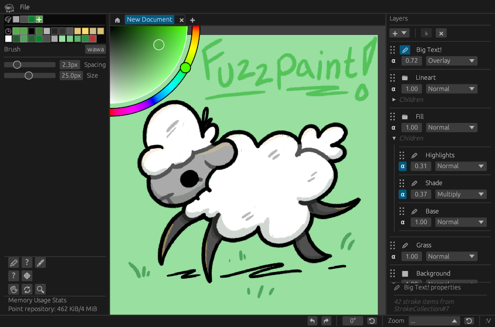

# 
 Fuzzpaint

A graphics-accelerated digital art software combining the ease-of-use of raster with the lossless quality of vector.

**This project is in heavy development**, many features are in-progress and semver is ignored. Notably, **drawings cannot yet be saved** - but you can doodle to your heart's content!

## Goals
* Fast, efficient, and instant to launch even on low power hardware.
* A workflow that serves everything from quick jotting down of ideas to detailed artworks.
* No choice is set in stone - change brushes, resolution, and colors retroactively in your work.
* Every edit is lossless and undo-able, even after you close the program - files include their entire undo tree.
* Small, portable, self-contained document files (for people like me who save every doodle!)
* In an error, unsaved changes should never be lost - losing user work is unacceptable!
* Resources are viral - take and use the brushes, textures, effects, fonts, etc. found in drawings you've downloaded.
* A modular application design allowing CLI, headless servers, and graphical clients to all share the same codebase.

### Dreams
* Client/Server design allowing realtime peer-to-peer collaboration.

### Non goals
* Image editing - though this project aims to provide my ideal digital art creation environment over traditional raster software, it does not aim to implement the other functions of a raster image editor.
* Vector design - Despite it's vector nature, Fuzzpaint does not aim to provide precise control over curves and is instead intended for freeform hand-drawn artwork.

## Building
Requires the [most recent Rust *nightly* toolchain](https://www.rust-lang.org/tools/install). Clone and execute `cargo +nightly run --release` from within the root directory of this repo!

## Platform Support
This app is cross platform and should run on any device that meets the [current vulkan requirements](assumptions.md).
(if your device doesnt work - even if it's because of these requirements - please file an issue!).

For tablet support, see the [octotablet](https://github.com/Fuzzyzilla/octotablet) sister project.

# Road to **0.2.0**
To declare **0.2.0**, I would like to be able to freely doodle a thing and save it to disk. We're getting dangerously close!

 - [ ] File I/O
   - [ ] Read/Write [custom vector image format](fileschema.md)
   - [ ] Write file history
   - [ ] Export common image formats
     - via image-rs/image
   - [X] [Shell integration](https://github.com/Fuzzyzilla/fuzzpaint-thumbnailer)
 - [ ] Brushes
   - [ ] Make and manage textured brushes from inside fuzzpaint
   - [ ] Save brushes to file
     - To document or to global repo? - resolved: both, with ~~UUIDs~~ cryptographic hashes! That way, files can be freely shared, and brushes can be easily re-used.
   - [X] Tesselation engine capable of mixed brushes
   - [X] Stamped brushes
   - [X] Efficient erasers
 - [ ] Layers
   - [X] Simple UI to manage layer creation, order, modes, etc.
   - [X] Blending compute shaders
     - take advantage of associativity and commutativity of blend modes to reduce number of distinct dispatches?
     - fall forward on `EXT_blend_operation_advanced` or `EXT_fragment_shader_interlock`?
   - [X] Passthrough, grouped-blend layers
   - [X] Color fill layers
   - [ ] Text layers
   - FX + other self-populating layers (clone, gradients) come later
 - [ ] UI
   - [X] Initial layout
   - [X] A ~~simple~~ **✨robust and rebindable✨** hotkey system, with support for
         pen and pad buttons (although, pen+pad events are not yet wired up)
   - [X] Application settings menu
   - [X] Infinite Undo/Redo
   - [X] Pan, Zoom, Scroll, Rotate
   - [ ] Mirror
   - [X] Fit, 100% modes
 - [ ] Editor
   - [ ] Color, Object Pickers
   - [ ] Select strokes
     - [ ] Select parts of strokes
   - [ ] Transform existing layers and strokes
   - [ ] Cut, Copy, Paste strokes (within program only)

